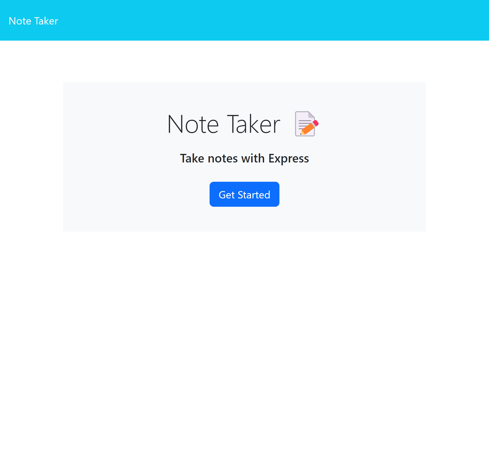

# My_Express_NoteTaker-App

#Description

Express.js Note-Taker

For this Application its supposed to be a note-taker that starts with the notes homepage. The user will then see a button to start and will got to the page with notes using routes. The page needs to have functionality to get all the notes, get a note by its Id, create a new note, or delete a note from the list of notes. The application does this using routes and functions that work with express.js going to the path from the port based on routes. 

#Mock_UP

#Usage

The application can be improved further upon to create a movie or blog application that saves what was watched, created, deleted, or added based on the users input.
More icons or animations could be added to make the application more visuallly appealing for the user.

#Credits

Heroku-Deploy="https://git.heroku.com/my-express-note-taker-app.git"

Github-Deploy="https://ameridacas.github.io/Express_NoteTaker-App/"

Github-Repo="https://github.com/ameridacas/Express_NoteTaker-App/"